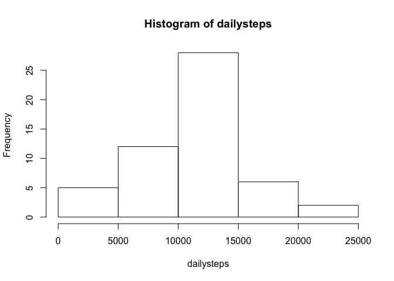
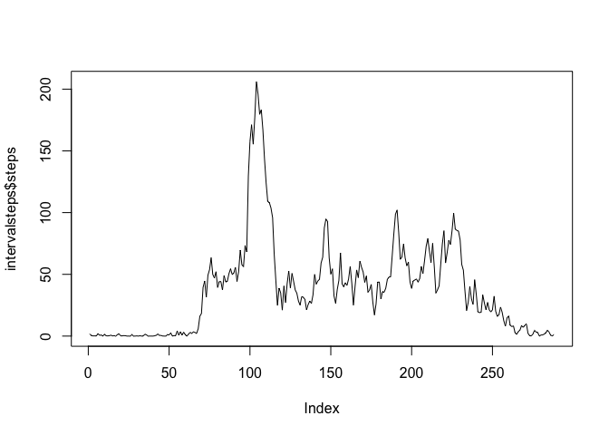
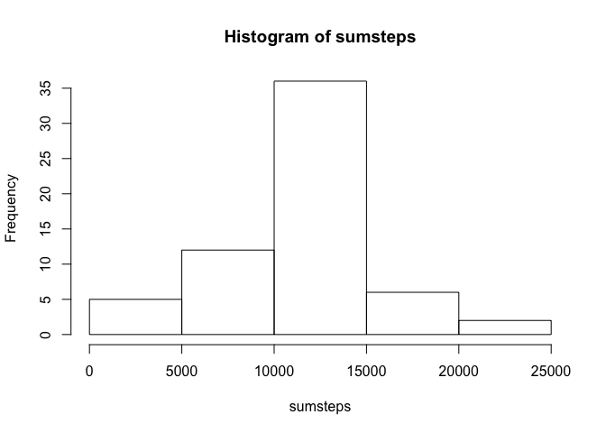

# Reproducible Research: Peer Assessment 1


### Loading and preprocessing the data

```r
data <- read.csv("/Users/anthonykong/repdata_peerassessment1/activity.csv")
```

### What is mean total number of steps taken per day?


```r
dailysteps <- aggregate(steps ~ date, data, sum)$steps
hist(dailysteps)
```

 

####Calculate and Report the mean and median of the total number of steps taken per day

Mean Data

```r
meandata <- mean(dailysteps)
meandata
```

```
## [1] 10766.19
```

Median Data

```r
mediandata <- median(dailysteps)
mediandata
```

```
## [1] 10765
```

### What is the average daily activity pattern?

```r
intervalsteps <- aggregate(steps ~ interval, data, mean)
plot(intervalsteps$steps, type = 'l')
```

 

#### Which 5-minute interval, on average across all the days in the dataset, contains the maximum number of steps?


```r
intervalsteps$interval[which.max(intervalsteps$steps)]
```

```
## [1] 835
```

### Imputing missing values


```r
sum(is.na(data))
```

```
## [1] 2304
```

#### Devise a strategy for filling in all of the missing values in the dataset. The strategy does not need to be sophisticated. For example, you could use the mean/median for that day, or the mean for that 5-minute interval, etc.

We will use a mean strategy for the 5 minute interval

#### Create a new dataset that is equal to the original dataset but with the missing data filled in.

```r
data <- merge(data, intervalsteps, by= 'interval', suffixes = c('','.y') )
nulls <- is.na(data$steps)
data$steps[nulls] <- data$steps.y[nulls]
data2 <- data[,c(1:3)]
```

#### Make a histogram of the total number of steps taken each day and Calculate and report the mean and median total number of steps taken per day. Do these values differ from the estimates from the first part of the assignment? What is the impact of imputing missing data on the estimates of the total daily number of steps?

```r
sumsteps <- aggregate(steps ~ date, data2, FUN = sum)$steps
hist(sumsteps)
```

 

The impact looks fairly low


### Are there differences in activity patterns between weekdays and weekends?

####Create a new factor variable in the dataset with two levels – “weekday” and “weekend” indicating whether a given date is a weekday or weekend day.


```r
typeofday <- function(date)
{
    if(weekdays(as.Date(date)) %in% c('Saturday','Sunday'))
    {
        'weekend'
    }
    else
    {
        'weekday'
    }
}

data$typeofday <- as.factor(sapply(data$date, typeofday))
```

####Make a panel plot containing a time series plot (i.e. type = "l") of the 5-minute interval (x-axis) and the average number of steps taken, averaged across all weekday days or weekend days (y-axis). See the README file in the GitHub repository to see an example of what this plot should look like using simulated data.


```r
par(mfrow = c(2,1))
for (type in c('weekend', 'weekday'))
{
    typesteps <- aggregate(steps ~ interval, data, subset = data$typeofday == type, FUN = mean)
    plot(typesteps, type = 'l', main = type)
}
```

 

